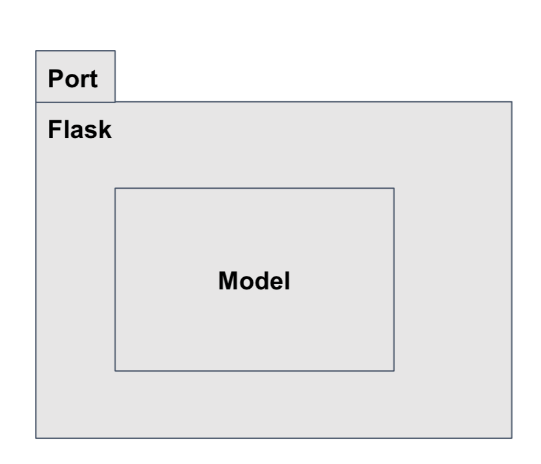
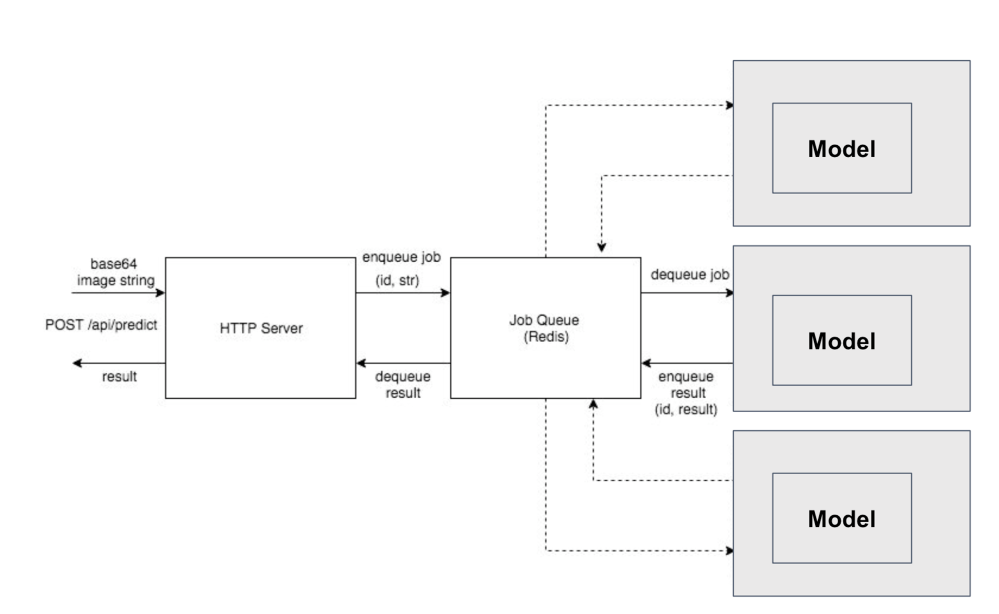

# Data Science Docker Tutorial

## Introduction

This is a simple example repository demonstrating the concepts behind Dockerizing a data science model into a production API. It is by no means production-ready since there are missing elements such as parameter hot-swapping, handling timeouts, logging, monitoring, authentication and security encryption. 

The use of libraries in this repository such as Flask and Redis make no opinion on what tools you should use. You should use your project requirements and decide the best tools to use depending on factors such as development work, maintainability, performance etc.

What this repository aims to teach are:

1. How to use Docker to build a single-container API
2. How to use Docker to build a multi-container API that includes some scaling considerations by the use of a job-queue. 

The commands in this tutorial are by no means exhaustive, but will cover the main use-cases in writing a Dockerized API for small Data Science projects. 

## Installation

1. Mac: [Docker for Mac](https://docs.docker.com/docker-for-mac/install/)
2. Linux: [Docker CE (community edition)](https://docs.docker.com/install/linux/docker-ce/]ubuntu/)


Choose the installation packages based on your host OS, and it will install Docker-CLI, containerd, Docker Server (daemon), networking drivers etc

For this repository to work, run `pip install -r requirements.txt` from `./src/simple_model_server`

## Docker commands

- List all images on host

```
docker images
docker image ls
```

- List all containers on host

Lists all running containers on host. Add `--all` flag if you want to view stopped containers too.

```
docker container ls
```

- Run docker image 

```
# Format: docker run <flags> <image_name> <command>
docker run -it ubuntu bash
```

In this case, you are running the container Ubuntu in interactive mode (accepts user input) and executing the command 'bash' in the ubuntu container. If the Ubuntu image is not present on your computer, it automatically downloads it.

- Stop docker container

```
docker stop <container id>
```

- Check status of containers
```
docker ps
docker logs <container_id>
```

- Stop container
```
docker stop <container_id>
```

## Writing a Dockerfile 

A Dockerfile creates a custom image in successive layers.

| Command | Meaning |
| --- | --- |
| FROM <base_image_name> | Use the stated base image to build this custom image |
| RUN <linux command> | Execute the Linux command in the image |
| WORKDIR <directory> | Make stated directory the current working directory in the image |
| COPY <src dir> <dest dir> | Copy file(s) from source directory on host to destination directory in the image |
| EXPOSE <port> | Expose the port of the container |
| CMD <command / array of commands > | Execute commands at the time of running the container |

- Minimize the duration of image build by making sure package installation happens early, and file copying happens later.
- Minimize the size of the Docker image by reducing the number of layers in the image
Take a look at the Dockerfile in `./src/simple_model_server/`

## Train ML model
Training script saves model weights in `./model/model.pkl`. Trains an XGBoost model on the Iris dataset in sklearn.

```
# Dir: ./src/
python train.py
```

## Single-container Example: `simple_model_server`

### Build image
```
# Dir: ./ds-docker-tutorial/
docker build -f ./src/simple_model_server/Dockerfile -t simple_model_server .
```
| Flag | Meaning |
| --- | --- |
| -f | Path to Dockerfile |
| -t | Name to tag image |
| . | Path to build context |

Build context is directory that refers to host's `./` in the Dockerfile (e.g. in `COPY ./* ./container_dir`), you will be copying every file in the build context dir to `./container_dir` in the container.

In this case, we want the build context to be ./ds-docker-tutorial/ because we want to copy the model weights as well as the source codes into the image.

### Run image
```
docker run -it -p 10000:10000 simple_model_server
```
| Flag | Meaning |
| --- | --- |
| -it| Interactive mode |
| -p <host_port>:<container_port> | Forwards host port to container port |

### Test that the API works

```
curl -XPOST http://0.0.0.0:10000/api/predict -d'{"data": [5.9, 3.2, 4.8, 1.8]}' -H 'Content-Type: application/json'
```

#### Result
```
{"name":"versicolor","prediction":1}
```

### Now we have a simple containerized Flask model API!


## Multi-container Example: docker-compose





For the purposes of scaling up our simple Flask API (which is definitely not production-ready), we modularize into: 

1. HTTP Server
	- Handles all the HTTP requests
	- Request validation logic
	- Can be replaced by Gunicorn to handle more concurrent HTTP requests
	
2. Job Queue
	- Handle processing/lag time for model inference
	- Handle demand spikes

3. Model Server (scale up to whatever number necessary for performance)
	- Model Inference

### Benefits of docker-compose

Now we have multiple containers, so we have a `http_server`, `redis_server` and `model_server` image.


1. Simple way to orchestrate containers instead of running ‘docker run’ for every single container in your pipeline and defining a network manually


2. Automatically creates a network bridge with internal DNS to allow containers to address each other by name


3. Can specify container dependencies


4. Can specify auto-restart rules if container dies for some reason


5. Can specify which host file system directory to mount to container file system (e.g. for logging and model weights)

### Writing a docker-compose.yml file

| Key | Meaning |
| --- | --- |
| version | docker-compose version |
| http_server | Service name given to Http server |
| redis_server | Service name given to Redis server |
| model_server | Service name given to Model server |
| build | Information regarding how to build the service's image |
| context | Build context path |
| dockerfile | Path to Dockerfile from build context, to build image |
| image | Name:tag given to image |
| ports | Port forwarding between host and container ports |
| restart | Restart policy: no, always, on-failure, unless-stopped |
| depends on | Services that this current service depend on. Listed services have to be running before this current service can run |
| runtime | By default not needed. Specify 'nvidia' if nvidia-docker is installed, to be able to use GPU |
| environment | Specify environment variables and their values |
| volumes | Mounts host directory to container directory for container persistence |

Refer to `./docker-compose.yml`

### Build images
```
# Dir: ./ds-docker-tutorial/
docker-compose -f ./docker-compose.yml build
```
| Flag | Meaning |
| --- | --- |
| -f | Path to Dockerfile |
| -t | Name to tag image |
| . | Path to build context |

Build context is directory that refers to host's `./` in the Dockerfile (e.g. in `COPY ./* ./container_dir`), you will be copying every file in the build context dir to `./container_dir` in the container.

In this case, we want the build context to be ./ds-docker-tutorial/ because we want to copy the model weights as well as the source codes into the image.

### Run images
```
# Dir: ./ds-docker-tutorial/
docker-compose -f docker-compose.yml -p docker-tutorial up --scale model_server=6 -d
```
| Flag | Meaning |
| --- | --- |
| -f | Path to docker-compose file |
| -p | Prefix for container names when running them |
| --scale `<service>=<number>` | Scales the relevant service to the desired number of copies |
| -d | Run the containers in the background and return control to terminal |

### Check status
```
# List running containers
docker ps
docker-compose ps

# Logs
# Dir: ./ds-docker-tutorial/
docker-compose -f docker-compose.yml -p docker-tutorial logs
```

### Stop
```
# Dir: ./ds-docker-tutorial/
docker-compose -f docker-compose.yml -p docker-tutorial down
```


